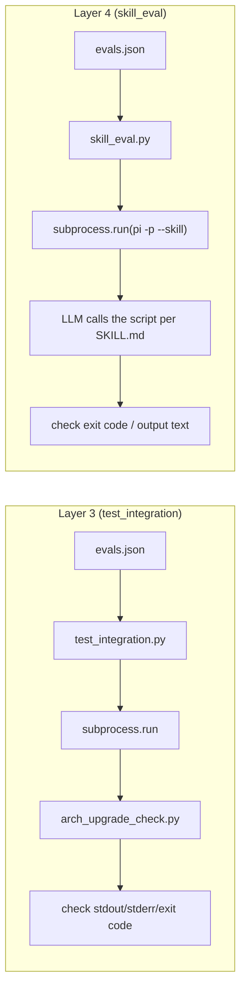

# Testing & Evaluation Guide

The Arch Linux Upgrade Check Skill uses a four-layer testing system to ensure
reliability -- from fast function-level tests to full-flow LLM end-to-end
evaluation.

---

## Quick Start

```bash
# Layer 1+2: fast verification (~0.1s, fully offline)
python3 tests/test_find_packages.py
python3 tests/test_scraping.py

# Layer 3: script integration tests (~15s, fully offline mock)
python3 scripts/test_integration.py

# Layer 4: skill end-to-end evaluation (slow, needs pi + API)
python3 scripts/skill_eval.py --model <your-model>
```

---

## Four-layer system overview

| Layer | File | What it tests | Goes through LLM | Speed | Dependencies |
|-------|------|---------------|------------------|-------|---------------|
| **Layer 1** | `tests/test_find_packages.py` | Package-name matching `find_packages_in_text()` | No | ~0.05s | Pure Python |
| **Layer 2** | `tests/test_scraping.py` | HTML parsing functions (news, BBS, topic) | No | ~0.1s | Pure Python + local fixtures |
| **Layer 3** | `scripts/test_integration.py` | The script `arch_upgrade_check.py` as a black-box CLI | No | ~15s | Pure Python + mock data |
| **Layer 4** | `scripts/skill_eval.py` | LLM + SKILL.md: the model learns the script path and args from SKILL.md | Yes | 5-10min | pi CLI + API key |

### Layer 1 vs Layer 2

| | Layer 1: find_packages | Layer 2: scraping |
|--|----------------------|-------------------|
| **Test target** | `find_packages_in_text()` (one function) | `fetch_news_page()`, `fetch_bbs_page()`, `fetch_bbs_topic()`, etc. (5+ functions) |
| **Input** | Plain text strings | HTML files (real page snapshots) |
| **Assertions** | 19 | 103 |
| **Failure meaning** | Package-name matching logic (regex, blacklist) has a bug | The site's HTML structure changed, or the parsing code has a bug |

### Layer 3 vs Layer 4



---

## Layer 1: unit tests -- package matching

```bash
python3 tests/test_find_packages.py
```

Verifies `find_packages_in_text(packages, text)` across scenarios:

- Full package-name match, hyphenated match
- Base-name fallback match (>=5 chars / blacklist)
- Special chars (`gtk+`), word-boundary protection
- Blacklist filtering (`linux`, `python`, `archlinux`)

**Result: 19/19 pass**

---

## Layer 2: unit tests -- HTML parsing

```bash
python3 tests/test_scraping.py
```

Uses 7 pre-downloaded HTML fixtures (`tests/fixtures/`) to verify all
web-page parsing functions.

**Covered scenarios:**

| Fixture | Verification point |
|---------|-------------------|
| `news_page_1.html` | Latest news parsing, next-page detection |
| `news_page_14.html` | Oldest page (no next page), 2002-2004 articles |
| `bbs_page_1.html` | Latest BBS topics, next-page detection |
| `bbs_page_24.html` | Older dates, [SOLVED] detection |
| `bbs_page_50.html` | Edge case (page almost entirely sticky threads) |
| `bbs_topic_314363.html` | Multi-page topic content extraction |
| `bbs_topic_solved.html` | Single-page solved topic, HTML cleaning |

**Result: 103/103 pass**

---

## Layer 3: script integration tests

```bash
# All
python3 scripts/test_integration.py

# Specific tests
python3 scripts/test_integration.py --tests 1,3

# Output to a directory
python3 scripts/test_integration.py --output-dir /tmp/results

# Custom timeout
python3 scripts/test_integration.py --timeout 60
```

Uses mock data (`evals/mock/e*`), no network or `/var/log/pacman.log` needed.

### Assertion types

| Type | Checks |
|------|--------|
| `exit_code` | Script exit code == 0 |
| `json_valid` | stdout is valid JSON |
| `json_fields` | JSON contains the specified fields |
| `json_field_value` | JSON field equals the expected value |
| `text_contains` | stdout/stderr contains the specified text |
| `timeout` | Completes within the given time |

### Current results

**T1 regular-upgrade** -- 3/3 pass
Checks: exit 0, valid JSON output, contains `status`/`since_date`/`matches`
fields.

**T2 long-time-no-upgrade** -- 2/2 pass
Checks: `lookback_capped=true`, stderr contains the `archive.archlinux.org`
recommendation.

**T3 custom-days** -- 4/4 pass
Checks: exit 0, valid JSON, `match_count=1`, completes within 120s.

> **Total: 9/9 pass (100%)**
>
> Full results: `evals/output/benchmark.json`

---

## Layer 4: end-to-end skill evaluation

```bash
# All evals
python3 scripts/skill_eval.py --model <your-model>

# Specific evals
python3 scripts/skill_eval.py --model <your-model> --evals 1,3

# Output to a directory
python3 scripts/skill_eval.py --model <your-model> --output-dir /tmp/results

# Compare with-skill vs no-skill baseline (recommended)
python3 scripts/skill_eval.py --model <your-model> --baseline --output-dir /tmp/results

# Repeat each eval N times to dampen LLM variance
python3 scripts/skill_eval.py --model <your-model> --repeat 3
```

### Output structure

```
output-dir/
  benchmark.json          # JSON results
  benchmark.md            # readable summary
```

### Assertion types

| Type | Checks |
|------|--------|
| `exit_code` | pi -p exits successfully |
| `text_contains` | LLM output contains the specified text |
| `text_contains_any` | LLM output contains any of a keyword list |
| `timeout` | Completes within the given time |

### Test cases

| ID | Name | Prompt | Skill assertions |
|----|------|--------|------------------|
| E1 | regular-upgrade | "I'm about to run pacman -Syu; before that, check Arch official news and the forum for anything needing manual intervention. I last updated about two weeks ago." | no-crash, mentions-shadow-issue, mentions-sg-or-newgrp |
| E2 | long-time-no-upgrade | "I have a server that hasn't been updated for a year and a half; I used to just run pacman -Syu directly. Help me check if there's anything to watch out for this upgrade." | no-crash, recommends-archive, warns-against-direct-syu |
| E3 | custom-days | "Help me check whether the Arch community has mentioned any pipewire-upgrade-related issues in the last 90 days." | no-crash, mentions-glibc-crash, mentions-pipewire |

> The evals.json prompts are stored verbatim (originally Chinese, simulating a
> real user); the table above is an English gloss. See `evals/evals.json` for
> the exact prompts.

### Latest result (sensenova/glm-5.2, E1)

See `references/verification-design.md` for the full delta analysis. Headline:
with-skill 3/3 reports the shadow `sg` issue; baseline (under
`--mock --sys-mock`, completed mock network) **also** reports it -- the model
is strong enough to curl the right BBS board and follow the topic on its own.
Delta is 0 for GLM-5.2; a positive delta needs a weaker model.

---

## Result file locations

| Data | Path |
|------|------|
| Layer 3 integration results | `evals/output/benchmark.json` |
| Mock data | `evals/mock/e{1,2,3}/` |
| HTML test fixtures | `tests/fixtures/` |
| Design document | `references/design-decisions.md` |
| Detailed test plan | `references/test-plan.md` |
| Mock-env design | `references/mock-env-design.md` |
| System-mock design | `references/system-mock-design.md` |
| Delta analysis | `references/verification-design.md` |

---

## How to add a new test case

### Add a Layer 3 integration test

Edit `evals/evals.json`, add an entry:

```json
{
  "id": 4,
  "name": "my-new-test",
  "prompt": "user prompt (for Layer 4)",
  "script_assertions": [
    {"name": "script-exit-0", "description": "...", "type": "exit_code"}
  ],
  "skill_assertions": [
    {"name": "no-crash", "description": "...", "type": "exit_code"}
  ],
  "mock_args": {
    "pacman_log": "evals/mock/e4/pacman.log",
    "checkupdates": "evals/mock/e4/checkupdates.txt",
    "http_dir": "evals/mock/e4/http/"
  },
  "script_args": ["--json"]
}
```

Then create the corresponding mock data files under `evals/mock/e4/`.

### Add a Layer 2 HTML-parsing test

1. Download the HTML to `tests/fixtures/`
2. Add a new test method in `tests/test_scraping.py`

### Add a Layer 1 package-matching test

Add a new test method in the `TestFindPackages` class in
`tests/test_find_packages.py`.

---

## Full one-shot run

```bash
# Layers 1-3 (fully offline, ~15s)
python3 tests/test_find_packages.py && \
python3 tests/test_scraping.py && \
python3 scripts/test_integration.py

# Layer 4 (needs pi + API, ~10min)
python3 scripts/skill_eval.py --model <your-model> --output-dir /tmp/layer4
```

---

## Layer 4 with the transparent mock (--mock)

`--mock` starts a local mitmproxy that serves the `evals/mock` fixtures as if
they were `archlinux.org` / `bbs.archlinux.org`, so the agent's own `curl`
hits the same data the bundled script reads. This is the first step toward a
*fair* with-skill vs baseline comparison (see `references/mock-env-design.md`).

**One-time setup** (install mitmproxy in an isolated venv):
```
cd /path/to/archlinux-upgrade-check-skill
python3 -m venv scripts/.venv
scripts/.venv/bin/pip install mitmproxy
```

**Run** (with-skill only, mock on):
```
python3 scripts/skill_eval.py --model <provider/model> --evals 1 --mock
```

**Run a true baseline comparison** (with-skill vs no-skill, both under the
mock):
```
python3 scripts/skill_eval.py --model <provider/model> --evals 1 --mock --baseline
```

What happens under the hood:
- `mock_proxy.py` starts `mitmdump` with `mock_proxy_addon.py`; the addon maps
  `md5(url)` to `evals/mock/<eid>/http/<hash>.html` (the same scheme the script
  uses), returning a neutral 404 for unmapped URLs.
- `run_pi` injects `HTTPS_PROXY` / `SSL_CERT_FILE` / `NO_PROXY` (both cases)
  into the pi subprocess. `NO_PROXY` is auto-populated from
  `~/.pi/agent/models.json` so the LLM provider API bypasses the proxy.
- The mitmproxy CA is generated under `.mitm-conf/` (work-dir, bwrap-safe).

### System-layer mock (--sys-mock) for a real "no skill" baseline

`--baseline` alone leaves the skill files visible on disk (a proactive model
can `ls ..` and read `SKILL.md`). `--sys-mock` wraps the baseline `pi` run in
a bwrap sandbox that: overlays the skill tree with an empty tmpfs (so `cd
<skill-dir>` sees nothing), binds mock `checkupdates` / `pacman` /
`pacman.log` over the real ones (consistent with the prompt), pins `date` to a
fixed "today" (so all fixture dates are time-drift-immune), and runs in a
throwaway cwd outside the skill path. See
`references/system-mock-design.md`.

**Fair baseline = `--mock --sys-mock` together**: `--mock` gives both sides the
same mock network; `--sys-mock` hides the skill from the baseline. Run:
```
python3 scripts/skill_eval.py --model <provider/model> --evals 1 \
  --mock --baseline --sys-mock
```

Note: `--sys-mock` only applies to the baseline run. With-skill must NOT use
it -- bwrap hides the `.pi/skills` tree that with-skill needs for discovery.

### Generating mock fixtures

Mock HTTP fixtures are produced from `tests/fixtures/` by:
```
python3 scripts/prepare_mock_fixtures.py
```
This copies each fixture into `evals/mock/e{1,2,3}/http/` renamed by
`md5(url)` (matching the script's URL -> md5 lookup). It also regenerates the
hand-crafted `pacman.log` (fixed dates, see below) and `checkupdates.txt`.

**Fixed dates (time-drift-immune)**: the mock `date` shim (bwrap-only) pins
"today" to 2026-08-31; `pacman.log`'s last upgrade is fixed at 2026-08-17 (14
days before); the mock shadow BBS topic is dated 2026-08-25 (after the last
upgrade, so the script's `fetch_bbs(since_date)` keeps it instead of
filtering it out). News fixtures keep their real-snapshot dates (all before
the upgrade). This keeps the prompt's "two weeks ago" / "a year and a half
ago" wording correct regardless of the real current date.

---

## FAQ

**Q: Why is mock data needed?**
A: Real data depends on network and local system state, so it is not
reproducible. Mock data gives consistent results on any machine.

**Q: Why does Layer 4 fluctuate?**
A: LLM output is stochastic. The same prompt can produce different wording
across runs. This is normal; evaluate through multi-run aggregation
(`--repeat`).

**Q: The baseline also reported the shadow issue -- isn't the delta 0?**
A: For `sensenova/glm-5.2`, yes. The model is strong enough to curl the BBS
"Pacman & Package Upgrade Issues" board (id=44, the same board the script
hardcodes) and follow the shadow topic on its own. Delta=0 here is honest -- it
means GLM-5.2 is above the skill's usefulness threshold for this task, not
that the skill is worthless. A positive delta needs a weaker model or a harder
task. See `references/verification-design.md`.
