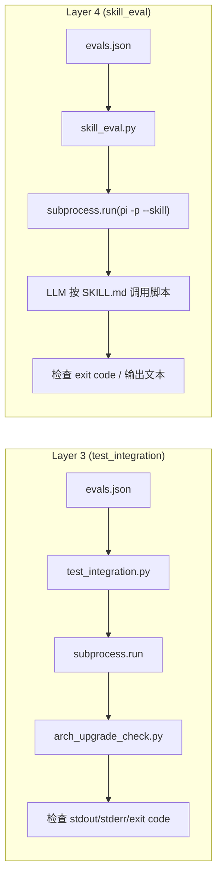

# Testing & Evaluation Guide

Arch Linux Upgrade Check Skill 使用四层测试体系来确保可靠性——从快速函数级测试到全流程 LLM 端到端评测。

---

## Quick Start

```bash
# Layer 1+2: 快速验证（~0.1s，全离线）
python3 tests/test_find_packages.py
python3 tests/test_scraping.py

# Layer 3: 脚本集成测试（~15s，全离线 mock）
python3 scripts/test_integration.py

# Layer 4: 技能端到端评测（慢，需要 pi + API）
python3 scripts/skill_eval.py --model <your-model>
```

---

## 四层体系总览

| 层 | 文件 | 测什么 | 经过 LLM | 速度 | 依赖 |
|----|------|--------|---------|------|------|
| **Layer 1** | `tests/test_find_packages.py` | 包名匹配函数 `find_packages_in_text()` | ❌ | ~0.05s | 纯 Python |
| **Layer 2** | `tests/test_scraping.py` | HTML 解析函数（news, BBS, topic） | ❌ | ~0.1s | 纯 Python + 本地 fixture |
| **Layer 3** | `scripts/test_integration.py` | 脚本 `arch_upgrade_check.py` 作为黑盒 CLI | ❌ | ~15s | 纯 Python + mock 数据 |
| **Layer 4** | `scripts/skill_eval.py` | LLM + SKILL.md：模型通过 SKILL.md 学会调用脚本的路径和参数 | ✅ | 5-10min | pi CLI + API key |

### Layer 1 和 Layer 2 的区别

| | Layer 1: find_packages | Layer 2: scraping |
|--|----------------------|-------------------|
| **测试对象** | `find_packages_in_text()` 一个函数 | `fetch_news_page()`, `fetch_bbs_page()`, `fetch_bbs_topic()` 等 5+ 函数 |
| **输入** | 纯文本字符串 | HTML 文件（真实网页快照） |
| **断言数** | 19 | 103 |
| **失败含义** | 包名匹配逻辑（正则、黑名单）有 bug | 网站 HTML 结构变了，或解析代码有 bug |

### Layer 3 和 Layer 4 的区别



---

## Layer 1: 单元测试 — 包名匹配

```bash
python3 tests/test_find_packages.py
```

验证 `find_packages_in_text(packages, text)` 在各种场景下的正确性：

- 完整包名匹配、带连字符匹配
- base name 回退匹配（≥5 字符 / 黑白名单）
- 特殊字符（`gtk+`）、词边界保护
- 黑名单过滤（`linux`, `python`, `archlinux`）

**结果：19/19 ✅**

---

## Layer 2: 单元测试 — HTML 解析

```bash
python3 tests/test_scraping.py
```

使用 7 个预下载的 HTML fixture（`tests/fixtures/`）验证所有网页解析函数。

**覆盖场景：**

| Fixture | 验证点 |
|---------|--------|
| `news_page_1.html` | 最新新闻解析、翻页检测 |
| `news_page_14.html` | 最旧页面（无下一页）、2002-2004 年文章 |
| `bbs_page_1.html` | 最新论坛主题、翻页检测 |
| `bbs_page_24.html` | 更早日期、「已解决」检测 |
| `bbs_page_50.html` | 几乎全是置顶帖的边缘情况 |
| `bbs_topic_314363.html` | 多页主题内容提取 |
| `bbs_topic_solved.html` | 单页已解决主题、HTML 清理 |

**结果：103/103 ✅**

---

## Layer 3: 脚本集成测试

```bash
# 全部
python3 scripts/test_integration.py

# 指定测试
python3 scripts/test_integration.py --tests 1,3

# 输出到文件
python3 scripts/test_integration.py --output-dir /tmp/results

# 自定义超时
python3 scripts/test_integration.py --timeout 60
```

使用 mock 数据（`evals/mock/e*`），不依赖网络或 `/var/log/pacman.log`。

### 断言类型

| 类型 | 检查对象 |
|------|---------|
| `exit_code` | 脚本退出码 == 0 |
| `json_valid` | stdout 是合法 JSON |
| `json_fields` | JSON 包含指定字段 |
| `json_field_value` | JSON 字段等于预期值 |
| `text_contains` | stdout/stderr 包含指定文本 |
| `timeout` | 在指定时间内完成 |

### 当前结果

**T1 regular-upgrade** — 3/3 ✅  
检查：退出码 0、输出合法 JSON、包含 `status`/`since_date`/`matches` 字段

**T2 long-time-no-upgrade** — 2/2 ✅  
检查：`lookback_capped=true`、stderr 包含 `archive.archlinux.org` 推荐

**T3 custom-days** — 4/4 ✅  
检查：退出码 0、合法 JSON、`match_count=1`、120s 内完成

> **Total: 9/9 ✅ (100%)**
>
> 完整结果见 `evals/output/benchmark.json`

---

### Layer 4: 端到端技能评测

```bash
# 全部评测
python3 scripts/skill_eval.py --model <your-model>

# 指定测试
python3 scripts/skill_eval.py --model <your-model> --evals 1,3

# 输出到目录
python3 scripts/skill_eval.py --model <your-model> --output-dir /tmp/results

# 对比 with-skill vs no-skill baseline（推荐）
python3 scripts/skill_eval.py --model <your-model> --baseline --output-dir /tmp/results

# 每个 eval 重复 N 次抑制 LLM 方差
python3 scripts/skill_eval.py --model <your-model> --repeat 3
```

### 输出结构

```
output-dir/
├── benchmark.json            # JSON 结果
└── benchmark.md              # 可读摘要
```

### 断言类型

| 类型 | 检查对象 |
|------|---------|
| `exit_code` | pi -p 成功退出 |
| `text_contains` | LLM 输出包含指定文本 |
| `text_contains_any` | LLM 输出包含关键词列表中的任一个 |
| `timeout` | 在指定时间内完成 |

### 测试用例

| ID | 名称 | Prompt | Skill 断言 |
|----|------|--------|-----------|
| E1 | regular-upgrade | "我要跑 pacman -Syu 了，先帮我检查下 Arch 官网新闻和论坛…" | no-crash, mentions-shadow-issue, mentions-sg-or-newgrp |
| E2 | long-time-no-upgrade | "我有一台服务器一年半没更新了，之前都是直接 pacman -Syu 的…" | no-crash, recommends-archive, warns-against-direct-syu |
| E3 | custom-days | "帮我检查一下最近 90 天 Arch 社区有没有提到 pipewire 升级…" | no-crash, mentions-glibc-crash, mentions-pipewire |

---

## 结果文件位置

| 数据 | 路径 |
|------|------|
| Layer 3 集成测试结果 | `evals/output/benchmark.json` |
| Mock 数据 | `evals/mock/e{1,2,3}/` |
| HTML 测试 fixture | `tests/fixtures/` |
| 设计文档 | `references/design-decisions.md` |
| 详细测试计划 | `references/test-plan.md` |

---

## 如何添加新的测试用例

### 添加 Layer 3 集成测试

编辑 `evals/evals.json`，添加一个 entry：

```json
{
  "id": 4,
  "name": "my-new-test",
  "prompt": "用户 prompt（用于 Layer 4）",
  "script_assertions": [
    {"name": "script-exit-0", "description": "...", "type": "exit_code"}
  ],
  "skill_assertions": [
    {"name": "no-crash", "description": "...", "type": "exit_code"}
  ],
  "mock_args": {
    "pacman_log": "evals/mock/e4/pacman.log",
    "checkupdates": "evals/mock/e4/checkupdates.txt",
    "http_dir": "evals/mock/e4/http/"
  },
  "script_args": ["--json"]
}
```

然后在 `evals/mock/e4/` 下创建对应的 mock 数据文件。

### 添加 Layer 2 HTML 解析测试

1. 下载 HTML 到 `tests/fixtures/`
2. 在 `tests/test_scraping.py` 添加新的测试方法

### 添加 Layer 1 包名匹配测试

在 `tests/test_find_packages.py` 的 `TestFindPackages` 类中添加新的测试方法。

---

## 完整一键运行

```bash
# Layers 1-3（全离线，~15s）
python3 tests/test_find_packages.py && \
python3 tests/test_scraping.py && \
python3 scripts/test_integration.py

# Layer 4（需要 pi + API，~10min）
python3 scripts/skill_eval.py --model <your-model> --output-dir /tmp/layer4
```

---

## 常见问题

**Q: 为什么需要 mock 数据？**  
A: 真实数据依赖网络和本地系统状态，不可复现。Mock 数据让测试在任何机器上得到一致结果。

**Q: Layer 4 的结果为什么波动？**  
A: LLM 输出有随机性。同一 prompt 在不同 run 可能产生不同措辞。这是正常现象，需要通过多轮聚合来评估。
